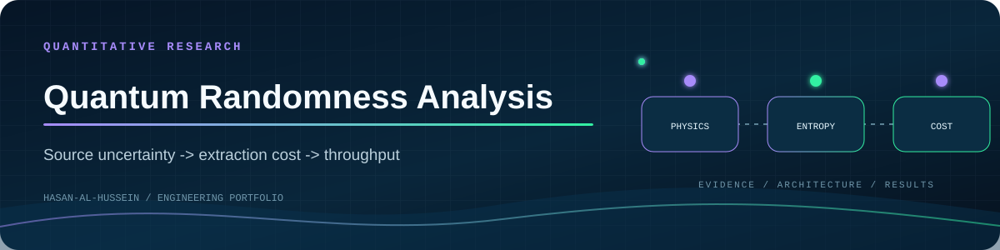

<div align="center">
  
  <br /><br />
  <a href="https://github.com/Hasan-Al-Hussein"></a>
</div>

# Quantum Randomness Analysis

Analytical framework for uncertainty propagation in beam-splitter-based quantum random number generators (QRNGs) and its impact on extraction efficiency, computational cost, throughput, and Gaussian random number generation.

> Research-style numerical and mathematical analysis connecting physical quantum source bias to practical computation cost.

<p align="center">
  
</p>

---

## Plain-English Summary

Quantum random number generators are only useful if their raw physical measurements can be converted into high-quality random bits efficiently. This project asks a practical question:

> If the physical source is slightly biased or uncertain, how much extra computation does the system need to produce reliable random numbers?

The analysis connects beam-splitter uncertainty to extraction efficiency, raw-bit cost, Gaussian random number generation cost, and throughput.

## Project Snapshot

| Area | Details |
|---|---|
| Topic | Quantum random number generation |
| Model | Beam-splitter source modeled as a Bernoulli process |
| Core question | How uncertainty affects extraction and computation |
| Methods | Entropy analysis, Taylor approximation, Fisher information, throughput modeling |
| Output | Analytical framework, plots, and technical report |

# Overview

This research project investigates how uncertainty in beam-splitter-based quantum random number generators propagates through randomness extraction and downstream computational stages.

The work focuses on:

- Quantum randomness generation
- Bernoulli source modeling
- Randomness extraction efficiency
- Uncertainty propagation
- Uniform random bit generation cost
- Gaussian random number generation
- Throughput degradation
- Latency analysis

The project develops a unified analytical framework connecting physical source imperfections directly to computational performance overhead.

---

# System Model

The QRNG source is modeled as a Bernoulli process:

```math
P(X=1)=p,\qquad P(X=0)=1-p
```

where:

- \( p \) represents the beam-splitter transmissivity
- \( X \) represents the measured quantum outcome

Under ideal conditions:

```math
p = 0.5
```

which corresponds to maximum entropy and unbiased randomness generation.

---

# Extraction Efficiency Analysis

## Von Neumann Extraction Efficiency

The extraction efficiency is defined as:

```math
\eta(p)=p(1-p)
```

where:

- \( \eta(p) \) is the output efficiency
- \( p \) is the Bernoulli source parameter

The function reaches maximum efficiency at:

```math
\eta(0.5)=0.25
```

meaning that even ideal sources lose a significant portion of raw measurements during extraction.

---

<p align="center">
  
</p>

The graph illustrates:
- maximum efficiency at \( p=0.5 \)
- nonlinear degradation under bias
- increasing sensitivity near the optimal operating point

---

# Sensitivity to Source Uncertainty

Near the optimal operating point:

```math
p = 0.5 - \delta p
```

the extraction efficiency becomes:

```math
\eta(0.5-\delta p)\approx0.25-(\delta p)^2
```

This demonstrates:
- quadratic efficiency degradation
- strong sensitivity to uncertainty
- nonlinear computational overhead growth

---

# Cost & Computational Analysis

## Uniform Bit Generation Cost

The expected raw-bit cost for generating one unbiased output bit is:

```math
C_u(p)=\frac{1}{p(1-p)}
```

At the optimal operating point:

```math
C_u(0.5)=4
```

meaning four raw quantum measurements are required on average for one unbiased random bit.

---

## Gaussian Random Number Generation Cost

The Gaussian generation cost is modeled as:

```math
C_g(p)=\frac{2}{p(1-p)}
```

At ideal conditions:

```math
C_g(0.5)=8
```

showing that Gaussian random generation amplifies uncertainty-related computational cost.

---

<p align="center">
  
</p>

The analysis quantifies:
- extraction efficiency degradation
- raw-bit generation cost
- computational overhead
- uncertainty amplification

under varying QRNG source conditions.

---

# Throughput & Latency Analysis

## Estimation Precision Bound

Parameter estimation uncertainty is bounded by the Cramér–Rao inequality:

```math
Var(\hat{p}) \geq \frac{p(1-p)}{N}
```

where:

- \( \hat{p} \) is the estimated source parameter
- \( N \) is the number of collected samples

This establishes the throughput–precision trade-off central to the project.

---

<p align="center">
  
</p>

The project evaluates how uncertainty affects:

- randomness throughput
- extraction efficiency
- Gaussian generation latency
- computational stability
- system-level performance

The framework directly links physical QRNG imperfections to measurable computational cost.

---

# Key Contributions

- Unified framework for QRNG uncertainty propagation
- Closed-form extraction efficiency approximations
- Uniform and Gaussian random generation cost models
- Throughput–precision trade-off analysis
- System-level interpretation of uncertainty effects
- Quantitative performance degradation analysis

---

# Technologies & Methods

## Mathematical & Statistical Methods

- Bernoulli modeling
- Shannon entropy analysis
- Fisher information
- Cramér–Rao bounds
- Taylor approximation
- Uncertainty propagation
- Throughput modeling

## Computational Analysis

- Python
- Numerical evaluation
- Performance analysis
- Cost modeling

---

# Results

| Metric | Observation |
|---|---|
| Extraction Efficiency | Governed by \( p(1-p) \) |
| Sensitivity | Quadratic near \( p=0.5 \) |
| Uniform Bit Cost | Increases under source bias |
| Gaussian Generation Cost | Strongly affected by uncertainty |
| Throughput | Degrades with parameter uncertainty |
| Latency | Increases as uncertainty grows |

---

# Main Takeaway

Even a small deviation from an ideal 50/50 quantum source can increase the raw measurements needed to produce usable random numbers. The cost becomes more visible when the random bits are used for Gaussian sampling, where uncertainty is amplified by the downstream generation process.

This makes QRNG design a full system problem: the physics, estimator precision, extraction algorithm, and application-level throughput all affect the final cost.

---

# Key Research Concepts

- Quantum random number generation
- Randomness extraction
- Entropy analysis
- Statistical estimation
- Throughput–precision trade-offs
- Computational cost modeling
- Uncertainty propagation

---

# Source Structure

```text
src/
├── efficiency_analysis.py
├── uncertainty_propagation.py
├── throughput_model.py
└── README.md
```

---

# Documentation

- [Full Technical Report](docs/qrng_uncertainty_report.pdf)

---

# Authors

- Hasan Al Hussein
- Omar Yousef
- Ahmad Alhawamdeh

Khalifa University
