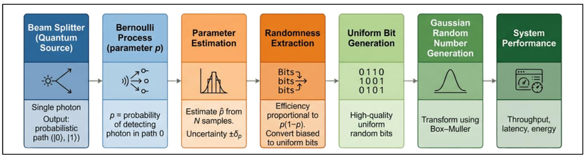
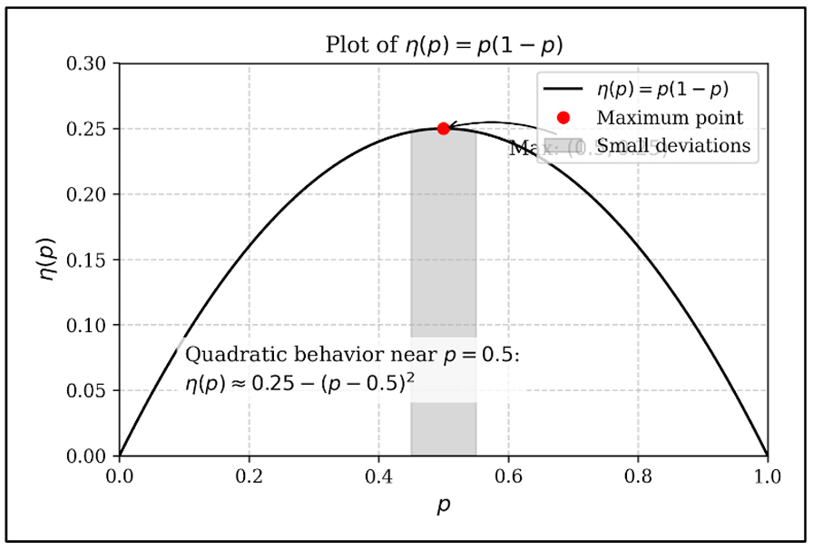
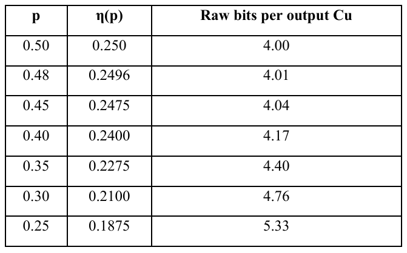
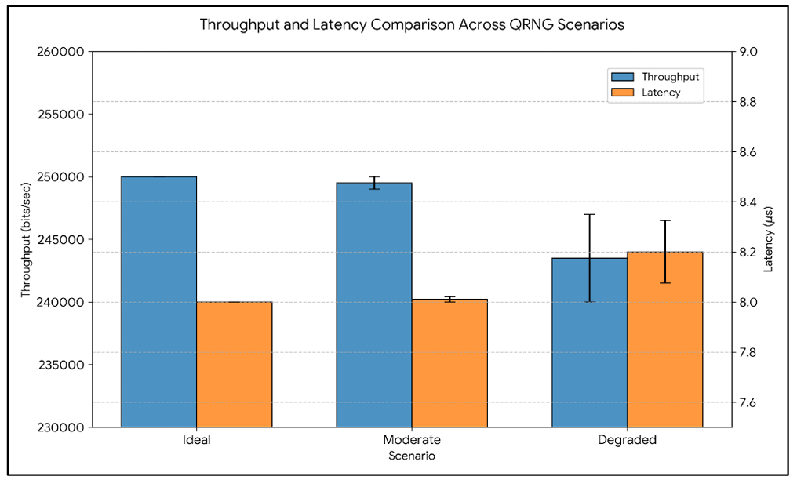

# Quantum Randomness Analysis

Analytical framework for uncertainty propagation in beam-splitter-based quantum random number generators (QRNGs) and its impact on computational efficiency, throughput, and Gaussian random number generation.

<p align="center">
  
</p>

---

# Overview

This project investigates how uncertainty in beam-splitter-based quantum random number generators propagates through randomness extraction and downstream computational processes.

The work focuses on:
- Bernoulli modeling of QRNG sources
- Randomness extraction efficiency
- Uncertainty propagation
- Throughput degradation
- Latency analysis
- Gaussian random number generation cost

The analysis establishes a unified relationship between physical source imperfections and computational overhead.

---

# QRNG Processing Pipeline

<p align="center">
  
</p>

The system pipeline consists of:

1. Beam-splitter quantum source
2. Bernoulli process modeling
3. Parameter estimation
4. Randomness extraction
5. Uniform bit generation
6. Gaussian random number generation
7. System-level performance analysis

---

# Extraction Efficiency Analysis

<p align="center">
  
</p>

The extraction efficiency is modeled as:

```math
η(p) = p(1-p)
```

The analysis demonstrates:
- quadratic sensitivity near the optimal operating point
- nonlinear degradation under source bias
- increased raw-bit cost as uncertainty grows

---

# Cost & Performance Analysis

<p align="center">
  
</p>

The framework quantifies:
- raw-bit cost
- extraction efficiency
- computational overhead
- throughput degradation
- latency increase

under varying source uncertainty conditions.

---

# Throughput & Latency Analysis

<p align="center">
  
</p>

The project evaluates how uncertainty affects:
- randomness throughput
- extraction efficiency
- Gaussian generation latency
- system-level performance stability

The analysis connects physical QRNG imperfections directly to computational resource cost.

---

# Key Contributions

- Unified analytical framework for QRNG uncertainty propagation
- Closed-form efficiency approximations
- Cost models for uniform and Gaussian random generation
- Throughput–precision trade-off analysis
- System-level interpretation of uncertainty effects

---

# Technologies & Methods

## Mathematical & Statistical Methods

- Bernoulli modeling
- Shannon entropy analysis
- Fisher information
- Cramér–Rao bounds
- Taylor approximation
- Uncertainty propagation

## Computational Analysis

- Python
- Numerical evaluation
- Performance modeling
- Throughput analysis

---

# Results

| Metric | Observation |
|---|---|
| Extraction Efficiency | Governed by \( p(1-p) \) |
| Sensitivity | Quadratic near \( p = 0.5 \) |
| Uniform Bit Cost | Increases under source bias |
| Gaussian Cost | Strongly affected by uncertainty |
| Throughput | Degrades with estimation uncertainty |
| Latency | Increases as uncertainty grows |

---

# Key Research Concepts

- Quantum random number generation
- Randomness extraction
- Entropy analysis
- Statistical estimation
- Throughput–precision trade-offs
- Computational cost modeling
- Uncertainty propagation

---

# Source Structure

```text
src/
├── efficiency_analysis.py
├── uncertainty_propagation.py
├── throughput_model.py
└── README.md
```

---

# Documentation

- [Full Technical Report](docs/qrng_uncertainty_report.pdf)

---

# Authors

- Hasan Al Hussein
- Omar Yousef
- Ahmad Alhawamdeh

Khalifa University
